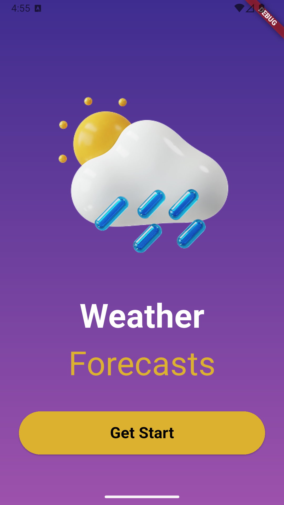
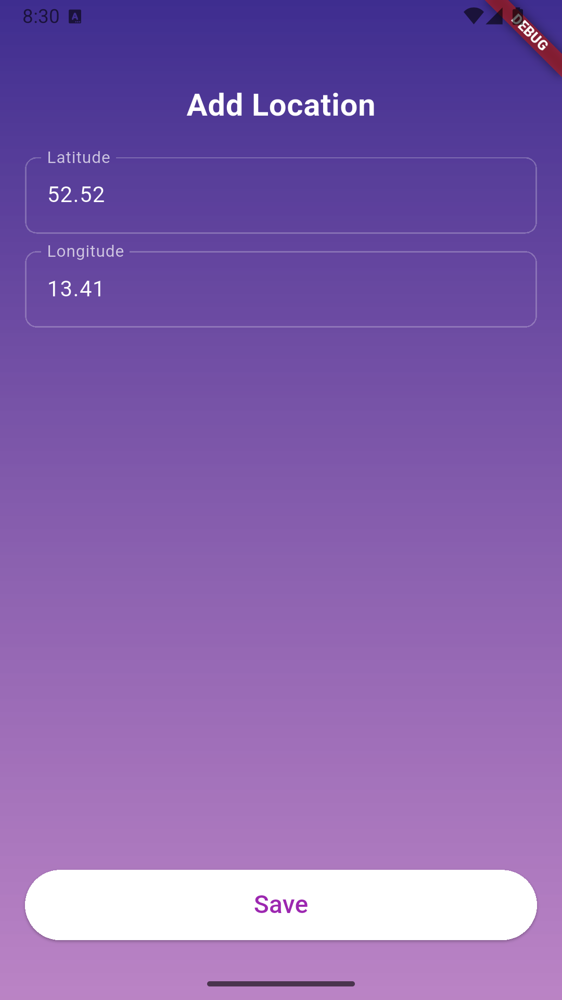
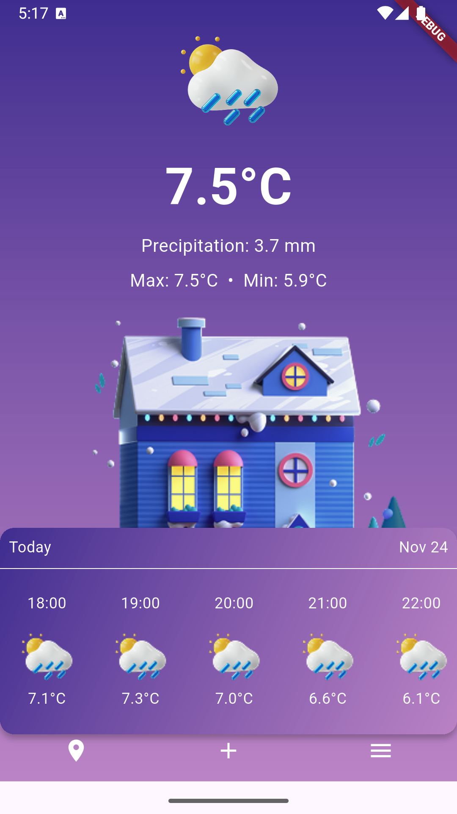

# weather_app

A new Flutter project : The Weather Forecast App

## Getting Started

This project is shows the details information about maximum minimum temperature with hourly updates of today. It enlists 7-day forecast along with sunrise and sunset time.

## How to Use
You must provide longitude and latitude details to the given page. Then it renders necessary information to the homepage calling the API.

